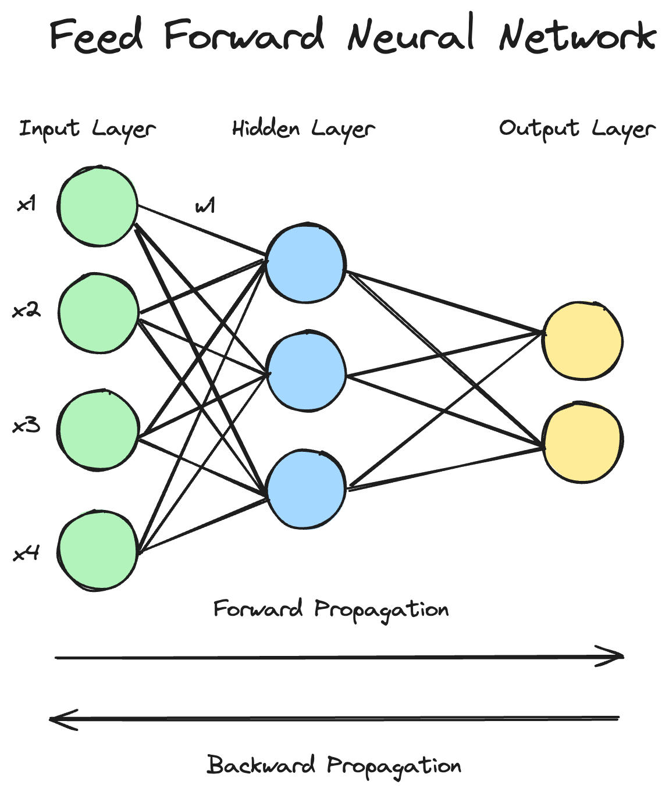

# Aufgabe 1: Wiederholung

> Welche Theorien haben Sie in diesem Teil des Kurses gelernt? Wie stufen Sie die Wichtigkeit derer ein?

## Unterscheidung Artificial Intelligence, Machine Learning und Deep Learning
Grundsätzlich finde ich es wichtig, dass zwischen Artificial Intelligence, Machine Learning und Deep Learning unterschieden wird. Artificial Intelligence ist der Oberbegriff und umfasst sowohl Machine- als auch Deep-Learning. **Artificial Intelligence** ist eine Wissenschaft, die sich damit beschäftigt, Maschinen wie Menschen denken und handeln zu lassen. **Machine Learning** will den Computer dazu bringen Arbeiten zu erledigen, ohne dass dies durch explizite Programmierung erfolgt. **Deep Learning** ist eine Unterkategorie von Machine Learning und befasst sich mit Neuronalen Netzen.

## Machine Learning vs. Deep Learning
Bei Machine Learning muss das bestimmen der Features (Feature Extraction) durch den Menschen (manuell) erfolgen. Dies geschieht beim Deep Learning innerhalb des Netzes.

## Perceptron = Synapse
Das Perceptron (Kernbestandteil von Neuronalen Netzen) ist der Synapse nachempfunden. Es erhält Eingangsdaten (Inputs) welche mit Gewichten (Weights) multipliziert werden, anschliessend aufsummiert, mit einem Bias (kleiner Fehler) versehen und durch eine Aktivierungsfunktion gerechnet werden. Wichtig hierbei ist dass die Perceptrons wie die Synapsen entsprechende Verbindungen zu anderen Perceptrons aufweisen.

## Deep Learning ist nicht ein Wundermittel für alles
Es gibt verschiedene Arten Probleme zu lösen. Es gibt **regelbasierte Verfahren (Wenn... dann..)**, **Machine Learning (Bestimmung Hauspreis)** und **Deep Learning (Bildklassifikation und Spracherkennung)**.Deep Learning macht nicht für alles Sinn, die Sinnhaftigkeit ist Situationsabhängig.

## Das Ziel von Deep Learning
Schlussendlich ist ein "Modell" nur eine Ansammlung von trainierten Gewichten und Biases. Das Ziel von Deep Learning ist es die Parameter dahingehend zu optimieren, dass die **Vorhersage von den Trainingsdaten möglichst genau mit den echten Daten (Labels) übereinstimmt**.

# Aufgabe 2: Grundelemente
> Stellen Sie das Vorgehen und den Aufbau eines "Feed Forward Neural Networks" grafisch dar. Die Grafik soll alle Optimierungsschritte und Ablaufschritte enthalten.

{height=350px}

## Ablauf

### Bestimmung der Input
In einem ersten Schritt müssen zuerst die Inputgewichte **initial bestimmt werden**. Hierzu gibt es verschiedene Verfahren. Ein bekanntest Verfahren ist die **Random Uniform Initialization**. Hierbei werden die Gewichte einheitlich in einem bestimmten Intervall (-0.1, 0.1) verteilt.

### Forward Propagation
Anschliessend wird die Forward Propagation durchgegangen. Hierbei werden die Inputdaten mit den Gewichten multipliziert und mit einem Bias (kleiner Fehler) durch eine Aktivierungsfunktion (Sigmoid/ReLU) gerreicht.

### Back Progpagation
Anschliessend werden die Gewichte mittels einem Optimizer angepasst. Der Optimizer benutzt eine Fehlerfunktion. Das Ziel hierbei ist es das globale Minmimum der Fehlerfunktion zu finden. Der Optimierungsschritt wird innerhalb der **Back Propagation** gemacht. 

