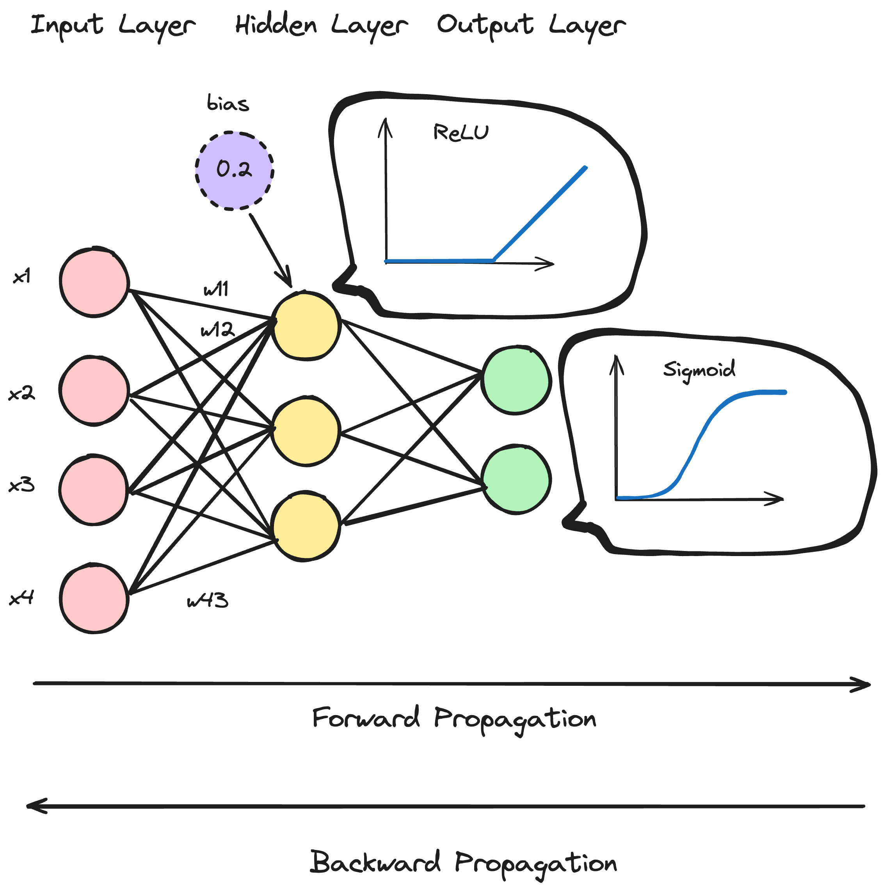

# Aufgabe 1: Wiederholung

> Welche Theorien haben Sie in diesem Teil des Kurses gelernt? Wie stufen Sie die Wichtigkeit deren ein?

TODO

## Aufgabe 2: Grundelemente
Stellen Sie das Vorgehen und den Aufbau eines "Feed Forward Neural Networks" grafisch dar. Die Grafik soll alle Optimierungsschritte und Ablaufschritte enthalten.

### Ablauf

#### Bestimmung der Input
In einem ersten Schritt müssen zuerst die Inputgewichte `initial bestimmt` werden. Hierzu gibt es verschiedene Verfahren. Ein bekanntest Verfahren ist die `Random Uniform Initialization`. Hierbei werden die Gewichte zufällig um den Mittelwert verteilt. Anschliessend wird die Forward Propagation durchgegangen. Hierbei werden die Inputdaten mit den Gewichten multipliziert und mit einem Bias (kleiner Fehler) durch eine Aktivierungsfunktion (Sigmoid) gerreicht. Anschliessend werden die Gewichte mittels einem Optimizer angepasst. Der Optimizer benutzt eine Fehlerfunktion. Das Ziel hierbei ist es das globale Minmimum der Fehlerfunktion zu finden. Der Optimierungsschritt wird innerhalb der `Back Propagation` gemacht. 

