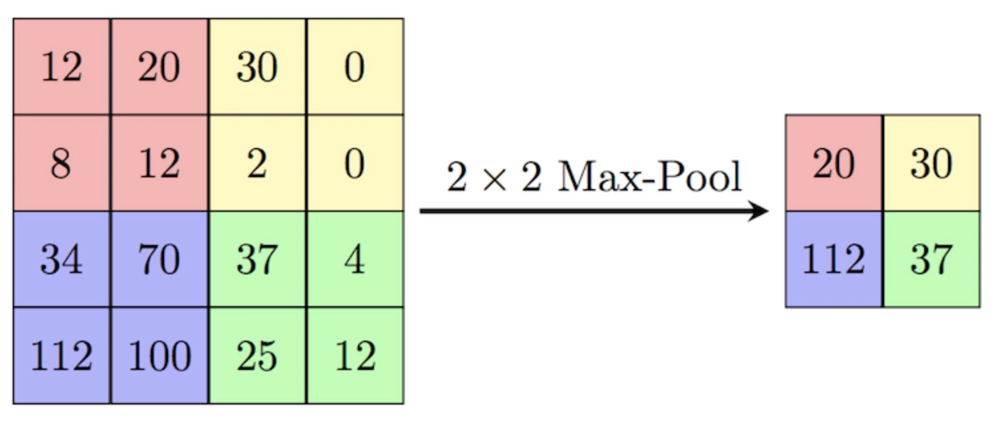

# Mögliche Prüfungsfragen

> Wieso wird ein Trainings- und ein Test Sample benötigt?

Das Trainings Sample wird zum trainieren des Modells verwendet, das Modell muss zuerst etwas "lernen". Das Test Sample wird zum "abfragen" des gelernten verwendet.

> Warum ist eine Lineare Regression als Modell nicht immer optimal?

Die vorhergesagten Werte können ausserhabt des Bereichs [0, 1] sein, was es schwierig macht die Werte als Wahrscheinlichkeiten zu interpretieren.

> Worin unterscheidet sich "supervised Learning" von "unsupervised Learning"?

Beim supervised Learning kennt man das Ziel (Label), welches beim unsupervised nicht der Fall ist. Alle Deep-Learning Verfahren sind supervised.

> Worin unterscheidet sich eine Regression im Gegensatz zu einer Klassifikation?

Die Regression versucht einen numerischen Wert vorherzusagen, bei der Klassifikation wird ein kategorischer Wert ermittelt. 

> Worin unterscheidet sich "Overfitting" von "Underfitting"?

Bei **Overfitting** ist das Modell zu sehr an die Daten angepasst und für andere, neue Daten unbrauchbar. Bei **Underfitting** ist das Modell nicht in der Lage irgendwelche Dinge vorherzusagen.

> Worin liegt der grosse Unterschied zwischen Maschine- und Deep-Learning?

Bei Machine-Learning ist noch ein Labeling durch Menschen notwendig, wobei beim Deep-Learning dieser Schritt vom Modell selbst erfolgt. Achtung das bedeutet nicht, dass keine Datenaufbereitung mehr notwendig ist. Deep-Learning Modelle haben in der Regela auch mehr Hidden Layers.

> Worin liegt der Unterschied zwischen Linearer- und Logistischer-Regression?

Die Linearen-Regression ist eine Binäre Klassifikation, es macht einen harten Schnitt und ermittelt immer eine Klasse. Die Logistische Regeression gibt Wahrscheinlichkeiten pro Klasse an.

> Warum muss die Aktivierungsfunktion des Output-Layers eine andere sein als die der Hidden-Layers

Die Aktivierungsfunktion des Output-Layers muss die Fragestellung beantworten und ist daher von der Fragestellung selbst abhängig.

> Wie kann Overfitting detektiert werden?

Overfitting ist vorhanden, wenn es eine sehr grosse Differenz zwischen `accuracy` und `val_accuracy` gibt. `accuracy` ist hierbei die Genauigkeit auf dem Trainingsdaten, wobei `val_accuracy` die Genauigkeit auf dem Testdaten ist.

> Was sind mögliche Hyperparameter eines Models?

- Anzahl der Hidden Nodes
- Anzahl der Hidden Layers
- Anzahl der Epochen
- Batchgrösse
- Regularisierungsparameter `regularization`

> Was ist die Problematik mit der Batch Size?

Eine zu grosse Batch Size kann dazu führen, dass alle Daten auf einmal gelernt werden, eine zu kleine Batch Size führt dazu, dass das Modell zu viel "hin und her springt".

> Wie wird die `accuracy` berechnet

Mithilfe der Konfusionsmatrix, d.h. wie viele Treffer gibt es und wie viele davon sind korrekt. TN (True Negatives) in Prozent zum Gesamtanteil.

> Warum macht es nicht immer Sinn die `accuracy` als Metrik zu nehmen?

Weil je nach Anwendungsfall die Precision teilweise überwiegt. Zum Beispiel im Falle von Beatmungsgeräten, wenn diejenigen Geräte erkennt werden wollen welche einen Fehler bei der Beatmung aufweisen. Auch der F1-Score kann von Bedeutung sein.

> Welche Verfahren werden in der Regularisierung verwendet?

Die Verfahren werden meistens in Kombination miteinander verwendet, bspw. Batch Normalisierung und L1/L2 Regularisierung.

> Was ist der unterschied zwischen Dense Layern und Convolutional Layern?

Dense Layer lernen globale Muster, Convolutional Layer lernen lokale Muster.

> Was macht Flattening?

Flattening überführt die höherdimensionierten Tensoren (3D, 4D etc.) auf Tensoren welche in einem Feed-Forward Neural Network verwendet werden können, d.h. Umwandlung in 1D Tensor.

> Was ist der Hauptvorteil der Data Augmentation?

Das Modell sieht die Daten nur einmal und nicht zweimal. 

> Was ist ein Problem bei Data Augmentation und wie kann dieses gelöst werden?

Die Daten sind stark korrelierend mit den Basisdaten. Overfitting kann daher nicht komplett vermieden werden. Eine Mögliche Lösung hierzu ist der Einsatz von Dropouts.

> Warum wird bei vortrainierten Modellen der Faltungs-und Polinomabschnitt eingefroren?

Um zu verhindern, dass beim Lernen die Gewichte und Bias aktualisiert werden und so der "Lernfortschritt" des vortrainierten Modells verloren geht.

> Was ist die Schwierigkeit bei einem Multi-Output Model?

Jedes Output Model hat in der Regel eine unterschiedliche Loss-Funktion. Die Verlustfunktion bei einem Multi-Model Output ist jedoch nur eine einzelne, welche die Summe aus den einzelnen Verlustfunktionen bildet. Mithlife von Gewichtungen kann der Schwerpunkt auf die einzelnen Verlustfunktionen gesetzt werden.

> Was ist der Unterschied zwischen Machine Learning und Deep Learning?

Bei Machine Learning muss die Feature Eingabe durch den Menschen (manuell) erfolgen. Dies geschieht beim Deep Learning innerhalb des Netzes.

> Was ist der Unterschied zwischen AI, ML und DL?

Artificial Intelligence ist der Oberbegriff und umfasst sowohl Machine- als auch Deep-Learning. **Artificial Intelligence** ist eine Wissenschaft, die sich damit beschäftigt, Maschinen wie Menschen denken und handeln zu lassen. **Machine Learning** will den Computer dazu bringen Arbeiten zu erledigen, ohne dass dies durch explizite Programmierung erfolgt. **Deep Learning** ist eine Unterkategorie von Machine Learning und befasst sich mit Neuronalen Netzen.

> Warum werden nicht mehr Layers fingetuned?

- Tieferliegende Layer speicher mehr generell, wiederverwendbare Features
- Höherliegende Layer speicher mehr spezialisierte Features
- Es ist nützlicher die höherliegenden (spezialisierteren) Layers zu trainieren
- Je mehr Layer als jedoch trainiert werden, desto grösser die Gefahr von Overfitting
- Lernrate sollte niedrig gehalten werden

# Anwendungsfälle für Künstliche Intelligence 
Es gibt verschiedene Verfahren, welche auf unterschiedliche Probleme angewendet werden können:

- **Regelbasierte Verfahren**: Wenn...dann
- **Machine Learning**: Bestimmung Hauptpreis 
- **Deep Learning**: Hauptsächlich für Bildklassifikation und Spracherkennung 

# Neuronales Netz

## Perceptron

> Die einzigen Dinge welche das Modell selbst berechnen sind die **Gewichte** und der **Bias**.

Das Perceptron (Kernbestandteil von Neuronalen Netzen) ist der Synapse nachempfunden. Es erhält Eingangsdaten (Inputs) welche mit Gewichten (Weights) multipliziert werden, anschliessend aufsummiert, mit einem Bias (kleiner Fehler) versehen und durch eine Aktivierungsfunktion gerechnet werden. Wichtig hierbei ist dass die Perceptrons wie die Synapsen entsprechende Verbindungen zu anderen Perceptrons aufweisen.

Das Perceptron ist aus folgenden Elementen aufgebaut:

- Mehrere Inputs
- Mehrere Gewichte (ein Gewicht pro Input)
- Bias

## Back Propagation
Die Back Propagation ist ein sehr wichtiger Bestand Teil des Machine Learnings. Zu Beginn gibt es die Forward Propagation. Hierbei werden die Werte einmal durch das Netz gereicht. Anschliessend wird der Fehler anhand einer **Verlustfunktion** berechnet. Die Verlustfunktion misst, wie sich die Vorhersage vom Modell zum reellen Wert unterscheidet.

## Loss Funktion
Beispiele für Loss Funktionen bei der Regression sind:

- Mean Squared Error
- Mean Absolute Error (Wurzel aus Mean Squared Error)

Beispiele für Loss Funktionen bei der Klassifikation sind:

- Binary Cross-Entropy
- Categorical Cross-Entropy

# Feed Forward Neural Network

> Erlaubt nur das Arbeiten mit 2D Tensoren

## Ablauf

### Bestimmung der Input
In einem ersten Schritt müssen zuerst die Inputgewichte **initial bestimmt werden**. Hierzu gibt es verschiedene Verfahren. Ein bekanntest Verfahren ist die **Random Uniform Initialization**. Hierbei werden die Gewichte einheitlich in einem bestimmten Intervall (-0.1, 0.1) verteilt.

### Forward Propagation
Anschliessend wird die Forward Propagation durchgegangen. Hierbei werden die Inputdaten mit den Gewichten multipliziert und mit einem Bias (kleiner Fehler) durch eine Aktivierungsfunktion (ReLU) gerreicht.

> Achtung: Hierbei ist wichtig dass sich die `Aktivierungsfunktion des Output Layers` von jener der Hidden Layer unterscheidet. Je nach Problemstellung ist eine andere Aktivierungsfunktion von Nöten. Bei einer binären Klassifikation kann beispielsweise eine Sigmoid Funktion verwendet werden.

### Backwards Progpagation
Anschliessend werden die Gewichte mittels einem Optimizer angepasst. Der Optimizer benutzt eine Fehlerfunktion. Das Ziel hierbei ist es das globale Minmimum der Fehlerfunktion zu finden. Der Optimierungsschritt wird innerhalb der **Back Propagation** gemacht. 

# Deep Learning
Es gibt verschiedene Arten Probleme zu lösen. Es gibt **regelbasierte Verfahren (Wenn... dann..)**, **Machine Learning (Bestimmung Hauspreis)** und **Deep Learning (Bildklassifikation und Spracherkennung)**.Deep Learning macht nicht für alles Sinn, die Sinnhaftigkeit ist Situationsabhängig.

Beim Deep Learning ist das Ziel **Dinge vorherzusagen**. Es gibt grundsätzlich zwei Probleme welche wir lösen wollen:

- Klassifikation: Einfache Klassifikation (Ja/Nein Antworten) und Multi-Klassifikation (Erkennung handgeschriebener Ziffern)
- Regression: Vorhersage kontinuierlicher/numerischer Werte

## Ziel von Deep Learning
Schlussendlich ist ein "Modell" nur eine Ansammlung von trainierten Gewichten und Biases. Das Ziel von Deep Learning ist es die Parameter dahingehend zu optimieren, dass die **Vorhersage von den Trainingsdaten möglichst genau mit den echten Daten (Labels) übereinstimmt**.

## Berechnung der Gewichte
Um am Anfang die Gewichte zu bestimmen gibt es mehrere Möglichkeiten:

- Random Normal Initialization: Die Werte werden normalverteilt umd den Mittelwert 0 mit einer Standardabweichung von 1 verteilt.
- Random Uniform Initialization: Es werden zufällige Werte herausgesucht welche um den Mittelwert 0 verteilt sind
- Zeroes: Alle Werte werden auf 0 gesetzt
- Ones: Alle Werte werden auf 0 gesetzt

## Bestimmung von Hidden Layers und Nodes

> Die Anzahl der Hidden Layers sollte zwischen der Anzahl der Input und Output Nodes liegen

Am Anfang sollte mit einem Hidden Layer gestartet werden. Je mehr Hidden Layers desto komplexer. Die meisten Probleme können mit 2 Hidden Layers gelöst werden.

# Aktivierungsfunktionen

## Rectified Linear Unit (ReLU)
Ist die populärste Funktion für das Deep Learning. Alle negativen Werte werden auf 0 gesetzt und die positiven Werte bleiben positiv.

## Sigmoid

> Wird häufig in Feedforward Neural Networks verwendet.

Die Werte werden in den Bereich zwischen 0 und 1 gemapt, so können sie leicht als Wahrscheinlichkeiten interpretiert werden.

## Hyperbolic tangent
Ähnlich wie Sigmoid, die Werte werden jedoch in den Bereich -1 bis 1 gemapt.

## Output Layer

> Je nach Problemstellung muss eine andere Aktivierungsfunktion für den Output Layer definiert werden.

Bei den Output Layers werden folgende Funktionen verwendet:

- Sigmoid (Binäre Klassifikation): Wahrscheinlichkeiten zwischen 0 und 1
- Softmax (Multi-Klassifikation): Die Summe über alle Werte ist 1 
- Linear: Wird verwendet um Regressionsprobleme zu lösen, der Ausgabewert ist kontinuierlich

# Loss Funktion

> Die Verlustfunktion unterscheiden sich im Falle von Regression und Klassifikation. Bei der Regression sind die Verlustfunktion und die Evaluationsmetriken das selbe. Bei Klassifikation ist das nicht der Fall.

Die Lossfunktion beschreibt, wie sich die Vorhersage vom Modell zum reellen Wert unterscheidet
Hauptzwecke der Verlustfunktion ist das Optimieren der Parameter des Neuronalen Netzes während dem Training.

## Mean Squared Error (MSE)
Der MSE misst die durchschnittliche quadrierte Distanz zwischen den vorhergesagten und den tatsächlichen Werten.

\begin{align}
    MSE = \frac{1}{n} \dot \sum_{i = 1} (y_{i} - \hat{y_{i}})^2 \notag
\end{align}

## Mean Absolute Error (MAE)
Der MAE misst die durchschnittliche Differenz zwischen den vorhergesagten und den tatsächlichen Werten.

\begin{align}
    MAE= \frac{1}{n} \dot \sum_{i = 1} |y_{i} - \hat{y_{i}}| \notag
\end{align}

## Binary Cross-Entropy
Verlustfunktion welche für binäre Klassifikationsprobleme genutzt wird.

## Categorical Cross-Entropy
Verlustfunktion welche für Multiklassifikationsprobleme genutzt wird.

# Konfusions Matrix

Bei der Konfusions Matrix werden die vorhergesagten Werte mit den tatsächlichen Werten verglichen und in einer Matrix mittels True Positive (TP), False Positives (FP), True Negatives (TN) und False Negatives (FN) dargestellt.

## Accuracy

\begin{align}
    \frac{TP + TN}{TP + TN + FP + FN}
\end{align}

## Precision 

\begin{align}
    PPV = \frac{TP}{TP + FP}
\end{align}

## Recall (TPR) 

\begin{align}
    TPF = \frac{TP}{TP + FN}
\end{align}

## False Positive Rate (FPR) 

\begin{align}
    FPR = \frac{FP}{FP + TN}
\end{align}

## True Negative Rate (TNR) 

\begin{align}
    TNR = \frac{TN}{TN + FP}
\end{align}

# Optimizer

Ein Optimirer ist ein Algorithmus welcher die Parameter des Models so beeinflusst, dass die Verlustfunktion möglichst gering wird und die Gewichte dahingehend optimiert.

- Stochastic Gradient (SGD)
- Adaptive Moment Estimation (ADAM)
- Root Mean Square Propagation (RMSprop)

# Gradient Descend

> Das Gradientenverfahren minimiert die Verlustfunktion/Kostenfunktion. Die Hauptschwierigkeit ist hierbei ein lokales Minimum der Kostenfunktion zu finden.

Die Optimierer benutzen im Hintergrund ein Gradientenverfahren. Hierbei werden Minima der Kurve gesucht. Das Minimum ist dort wo die Ableitung Null ist (tiefste Punkte der Kurve). Hierbei kann es mehrere lokale Minima geben. Die optimale Lösung hierbei st jedoch das globale Minima (tiefster Punkt insgesamt in der Kurve).

Damit das Ganze aber funktioniert muss die Verlustfunktion ableitbar sein, d.h.:

- Mean Squared Error
- Binary Cross-Entropy Loss
- Categorical Cross-Entropy

# Lernrate

> Die Lernrate ist ein typischer Hyperparameter für das Deep Learning

- Die Lernrate kontrolliert die Step Size, mit welcher die Gewichte während des Trainings aktualisiert werden.
- Die Lernrate definiert wie schnell das Modell von den Daten lernt
- Hat einen erheblichen Einfluss auf die Performance des Modells
- Bei einer zu hohen Lernrate konvergiert das Modell nicht (es läuft endlos)
- Bei einer zu niedrigen Lernrate bleibt das Modell in lokale Minima stecken

## Ermitteln der Lernrate
Für das Ermitteln der Lernrate gibt es verschiedene Strategien:

- Step decay - Lernrate wird immer um einen konstanten Faktor nach jeder Epoche minimiert
- Exponential decay - Lernrate reduziert sich exponentiell über die Zeit
- Adaptive - Aufgrund der durchgeführten Trainingsschritte passt sich die Lernrate adaptiv an.

# Epoche

Ein einzelner Trainingsschritt wird als Epoche bezeichnet. Bei jeder Epoche wird jeweils Forward- und Backwards-Propagation Schritt durchgeführt.
Während einer Epoche werden immer alle Parameter (Gewichte und Bias) aktualisiert:

- Zu hohe Lernrate und das Modell overfitted
- Zu tiefe Lernrate und das Modell konvergiert nicht

# Batches

Die Trainingsdaten werden in Batches organisiert. Zu Beginn werden kleine Batches erstellt (viele kleine Daten). So kann das Modell schnell lernen der Gradient ist jedoch instabieler. Anschliessend werden die Batches vergrössert. Hierdurch steigt die Berechnungszeit, der Gradient wird jedoch stabiler und robuster. Dies wird bspw. mit dem Adabatch erreicht:

Bei einer kleinen Batch Size lernt das Modell mehr robuste Features und besserer Performance. Jedoch geht auch das Trainieren länger. Eine grosse Batch Size führt zwar zu schnellerem Training und stabielerem Gradienten jedoch kann das Modell zu Overfitting neigen.

# Klassen und Labels

Grundsätzlich wird zwischen, Klassen, Samples und Labels unterschieden:

- Klassen: Entspricht einer Kategorie
- Samples: Entspricht den Datenpunkten
- Label: Ist die Klasse welche mit einem bestimmten Sample (Datenpunkt) assoziiert ist

# Tensoren

Tensoren beschreiben die Dimensionalität der Daten. Tensoren beinhalten immer nummerische Werte:

- 0D Tensoren - Skalare
- 1D Tensoren - Vektoren
- 2D Tensoren - Matrizen
- 3D Tensoren - Sensoren höherer Ordnung (3D = Würfel), bspw. Text, Zeitreihen und Embeddings
- 4D Tensoren - Bilder - 2D CNN

Hierzu ein paar **Beispiele** für Tensoren:

- 2D Tensoren - Vektordaten
- 3D Tensoren - Zeitserien
- 4D Tensoren - Bilder (Samples, Height, Width, Channels)
- 5D Tensoren - Videos (Samples, Frame, Height, Width, Channels)

## Attribute
Ein Tensor besteht aus folgenden drei Attributen:

- Anzahl der Achsen (Rang), d.h. 1D Tensor hat eine Achse, 2D Tensor zwei etc.
- Shape - Beschreibt wie viele Dimensionen der Tensor pro Achse hat
- Datentyp - Beschreibt den Datentyp des Wertes an sich
- Die erste Achse in Numpy (Achse 0) entspricht der Anzahl der Samples

# Regularisierung

> Die Regularisierung selbst kann über den Hyperparameter `regularization` gesteuert werden. Dieser definiert, wie fest bestraft werden soll (Gewicht des Bestrafungswertes), d.h. der Lambda Parameter

Regularisierung ist eine Methode **um Overfitting zu verhindern**. Dies wird mithilfe eines **Bestrafungsgewichtes** erreicht, welches **zur Loss-Funktion hinzugerechnet wird**. Regularisierung hat mehrere Vorteile:

- Verbesserung der generellen Performanz des Models
- Verbesserung der Generalisierung von neuen Daten
- Die Verwendung des Bestrafungsgewichtes ermutigt das Modell kleinere Bias Werte zu verwenden

## L1 Regularisierung

> Die L1 Norm ist die Summe der absoluten Werte der Gewichte

Die Formel für die L1 Regularisierung lautet wie folgt:

$$ Loss = Data Loss + \lambda * |w| $$

- $DataLoss$ ist die Verlustfunktion des neuronalen Netzwerkes
- $w$ ist der Vektor mit den Gewichten (Bias)
- $|w|$ ist die L1 Norm der Gewichte (Bias)
- $\lambda$ ist der Hyperparameter **regularization** 

## L2 Regularisierung

> Die L2 Norm ist die Wurzel Summe der quadrierten Gewichte

Die Formel für die L2 Regularisierung lautet wie folgt:

$$ Loss = Data Loss + \lambda * ||w||^2 $$

- $DataLoss$ ist die Verlustfunktion des neuronalen Netzwerkes
- $w$ ist der Vektor mit den Gewichten (Bias)
- $||w||$ ist die L2 Norm der Gewichte (Bias)
- $\lambda$ ist der Hyperparameter **regularization** 

## Unterschiede L1 und L2 Regularisierung

- Die L1 Regularisierung tendiert dazu **Gewichtsvektoren mit vielen Nullen** zu erzeugen
- Die L1 Regularisierung ist nützlich für die Feature-Auswahl, nicht relevante Features werden durch die Regularisierung entfernt
- Die L2 Regulariiserung verteilt die Gewichte einheitlicher über alle Features

## Dropout

> Dropout verhindert, dass das Modell sich zu sehr auf einzelne Neuronen verlässt.

Dropout ist eine Regularisierungsmethode, bei welcher während des Trainings zufälligerweise Teile des Neuronalen Netzes "deaktiviert" werden. Dies führt dazu, dass die anderen Teilnehmer des Netzes dazu gezwungen werden, mehr robuste Features zu lernen.

Gängige Dropout-Raten sind:

- 0.8 für den Input Layer
- 0.5 für Hidden Layer

Der Dropout wird bei jedem Forward- und Backward Propagation Schritt pro Batch angewendet.

## Early Stopping

Early Stopping verhindert, dass das Modell weiter trainiert, wenn beim Validierungsschritt keine signifikante Verbesserung erfolgt. Early Stopping verhindert ebenfalls das Overfitting der Trainingsdaten.

## Bagging

Die Grundidee des Bagging besteht darin, dass mehrere Modelle gleichzeitig verwendet werden. Als Vorhersagewert wird dabei der Durchschnitt verwendet. Der Ablauf des Baggings ist wie folgt:

- Erstellung von k Datensätzen der ursprünglichen Grösse
- Trainieren von k Modellen
- Test: Nutze Durschnitt der Vorhersage aller Modelle

## Dataset Augmentation

> Achtung: Data Augmentation funktioniert nicht für jede Art von Datensätzen, bspw. MNIST

Dataset Augmentation ist eine Technik, bei denen neue Trainingsdaten generiert werden, indem verschiedene Transformationen angewendet werden:

- Farbveränderung
- Skalierung
- Zoom
- Rotation

Mithilfe von Data Augmentation kann das Model robustere Features lernen, zudem verbessert sich die Fähigkeit neue Daten zu verallgemeinern:

- Das Netzwerk sieht niemals die gleichen Inputdaten zweimal
- Inputdaten sind stark korrelierend (da sie lediglich transformiert wurden)
- Sollte am besten mit Dropout kombiniert werden um Overfitting vorzubeugen

## Batch Normalisierung

Mithilfe der Batch Normalisierung werden die Input Daten von Layern normalisiert:

- Stabilisierung der Verteilung bei der Aktivierungsfunktion
- Verhinderung von Overfitting
- Verbesserung der generellen Performanz des Modells

# Optimierung

Die Optimierung kann auf 3 Ebenen vorgenommen werden:

- Deep Learning Network
- Back Propagation
- Overfitting Management

## Tuning Parameter Deep Learning Network

Das Deep Learning Network kann mithilfe der folgenden Parameter optimiert werden:

- Anzahl der Epochen - Kann jedoch mit der Regularisationsmethode **Early Stopping** gut gehandhabt werden
- Grösse der Batches - Wichtig
- Anzahl der Hidden Layers - Standard verwenden bspw. 2
- Anzahl der Hidden Nodes - Wichtig
- Aktivierungsfunktionen - Standard verwenden
- Initialisierungsgewichte - Wichtig

## Tuning Parameter Back Propagation

Bei der Back Propagation gibt es folgende Parameter:

- Optimierer - In den meisten Fällen kann der Adam Optimierer (adaptives Modell) verwendet werden
- Lernrate
- Back Normalizer

Grosse Lernrate lassen das Modell schnell lernen, jedoch den Gradienten explodieren, d.h. das Modell wird nie aufhören und zu keiner Lösung kommen. Wenn die Lernrate zu klein ist, wird nicht das optimale globale Minimum innerhalb der Verlustfunktion gefunden.

## Overfitting Management

> Achtung: Overfitting Management sollte auch nur dann betrieben werden, wenn man ein Modell hat, welches einigermassen gute Ergebnisse liefert.

Die Parameter im Overfitting Management sind die folgenden:

- Regularisierung
- Dropouts
- Batch Normalization (Normalisierung der Gewichte) - Alle Gewichte haben den Mittelwert 0 und die Standardabweichung 1

# Convolutional Networks

> Wichtig: Convolutional Networks arbeiten mit 3D tensoren, d.h. mit Listen von Matrizen

Im Gegensatz zu Dense Layern, welche globale Muster lernen, konzentrieren sich die Convolutional Layers auf **lokale Muster**.
Convolutional Networks müssen mit 3D Tensoren arbeiten. Diese 3D Tensoren bestehen primär aus zwei räumlichen Achsen (Höhe und Breite) sowie einer Tiefenachse (Farbkanal). Bei Schwarz/Weiss Bildern hat die Tiefenachse nur eine Dimension

## Hauptmerkmale

Convolutional Networks besitzen zwei Hauptmerkmale. 

**Gelernte Muster sind universell einsetzbar**

- Sobald ein Muster gelernt wurde, kann das convnet dieses Muster überall erkennen
- Visuelles Welt ist nicht abhängig von der Übersetzung
- Es werden weniger Trainingsdaten benötigt

**Lernt räumliche Hierarchie von Mustern**

- Der erste convolutional Layer lernt kleine lokale Muster wie bspw. Kanten
- Der zweite Layer lernt grössere Muster, welche auf den kleinen Mustern des ersten Layers aufbauen
- Convnets erlauben das lernen von komplexen und abstrakten visuellen Konzepten

## Feature Map

- Die Convolutional Operation extrahiert Patches von den Input Daten
- Auf diese Patches wird **die gleiche Operation** angewendet, daraus entsteht die Feature Map (3D Tensor)
- Das Format dieser Feature Map ist ein 3D Tensor, bestehnd aus Breite, höhe und einer beliebigen Tiefe
- Die Tiefe ist ein Parameter des Layers und repräsentiert entsprechende Filter
- Filter kodieren spezifische Aspekte von den Input Daten

## Prozessablauf

- Über den 3D Tensor der Input Daten wird ein Filter (meistens 3x3 oder 5x5) gelegt
- Danach wird nur dieser Ausschnitt betrachtet, was bei einem 3D Tensor ein Teilwürfel (Patch) ist
- Der Würfel wird zu einem 1D Tensor (Vektor) umgeformt
- Alle 1D Tensoren werden anschliessend wieder zu einem Würfel zusammengesetzt
- Jede Zeile in diesem Würfel ist befindet sich an der gleichen Position wie der ausgeschnittene Teilwürfel (Patch) in der Input Feature Map

## Border Effekte

Border Effekte können auftreten wenn die Output Breite und Output Höhe sich von der Input Breite und Input Höhe unterscheiden, um diesem Effekt entgegenzuwirken gibt es zwei Möglichkeiten: 

- Padding
- Strides

### Padding
Beim Padding wird eine Anzahl von Zeilen und Spalten zur Input Feature Map hinzugefügt um wieder die gleiche Höhe und Breite zu erreichen.

### Strides

> Stride convolutions werden nur selten in der Praxis eingesetzt

Der Stride gibt an, mit welchem Abstand als ein Feature Window über die Input Daten bewegt wird. Ein Stride von 1 bedeutet bspw. dass das Feature Window 1 Pixel pro Durchlauf bewegt wird. Ein Stride von 2 hat zur Folge, dass die Feature Map um den Faktor 2 reduziert wird, weil nur jedes zweite Elemente berücksichtigt wird.

### Max-Pooling

> Max-Pooling wird eingesetzt um räumliche Hierarchische Features zu lernen. Ohne Max-Pooling kann es sein dass die Input Daten nicht genug sind um Features für das klassifizieren von Bildern zu lernen

- Max-Pooling kann für aggresives Downsampling der Feature Map genutzt werden, d.h. reduzierung der Parameter
- Max-Pooling extrahiert Ausschnitte aus der Input Feature Map und gibt jeweils pro Kanal nur den Maximalwert zurück
- Max-Pooling wird bspw. mit Ausschnitten der Grösse 2x2 betrieben um die Feature Map um den Faktor 2 zu reduzieren

Nebst Max-Pooling gibt es auch noch Average-Pooling. Max-Pooling funktioniert jedoch in der Regel besser, da der Maximalwert in der Regel mehr Informationsgehalt beinhaltet als der Durchschnittswert.

# Vortrainierte Modelle

Vortrainierte Modelle sind Modelle, welche nicht auf unseren Daten trainiert wurden sondern auf wesentlich grösseren Datenmengen. Die fertig trainierten Modelle können anschliessend von uns verwendet werden. Ein bekanntes Beispiel für ein vortrainiertes Modell ist ChatGPT. Heutzutage kann auf vortrainierten Modellen von ChatGPT aufgebaut werden und diese an unsere Anwendungsfälle angepasst werden.

Um diese Modelle zu nutzen gibt es zwei Möglichkeiten:

- Feature Extraction - Aus den Modellen werden die gelerten Features extrahiert
- Fine Tuning - Die Features beim Modell werden an unsere Fragestellung angeglichen

## Feature Extraction

> Die Feature Extraction ist in der Regel schneller, das Fine Tuning dauert länger und benötigt auch grösseren Rechenaufwand.

Bestehende Features und Faltungsteile werden wiederverwendete und nur das Klassifikations/Regressionsproblem wird neu gelöst. Wie viel wiederverwendet werden soll hängt davon ab, wie stark die Daten auf das neue Problem passen. Gibt es nur eine schwache Korrelation, so sollten nur die ersten Layers verwendet werden.

### Einzelne Schritte

> Wird das vortrainierte Modell nicht eingefrogen, würden die Gewichte aktualisiert werden und das Modell wäre zerstört

- Als Basis wird ein vortrainiertes Modell verwendet
- Eigenes Modell kann auf das vortrainierte Modell "draufgepackt" werden
- Vortrainiertes Modell wird "eingefroren"
- Eigenes Modell wird trainiert
- Vortrainiertes Modell wird "aufgetaut"
- Vortrainiertes Modell wird in Kombination mit dem eigenen Modell trainiert

## Fine Tuning

> Wird der Classifier nicht trainiert, würde der Lernfortschritt bei den neu trainierten Top Layers zunichte gemacht werden.

Fine Tuning erlaubt es neue Layers zu trainieren. Es werden nur neuen Layers (überhalb des Base Layers) sowie der Classifier neu trainiert.

### Einzelne Schritte

- Als Basis wird ein vortrainiertes Modell verwendet
- Eigenes Modell kann auf das vortrainierte Modell "draufgepackt" werden
- Der Baser Layer des vortrainierten Modells wird "eingefroren"
- Der neue Layer wird hinzugefügt und trainiert
- Die Layer darunter werden "aufgetaut" und zusammen mit dem neuen Layer trainiert

# Transformer Modelle (Sequence-to-Sequence Model)

> Wichtig: Die Normalisierung bei den Transformer Modellen wird nicht über die Batchnormalisierung gemacht sondern jeder Wert wird einzeln normalisiert.

Transformer Architektur wurde erfunden um automatisierte Übersetzungen durchzuführen. Sie basieren auf dem Prinzip der **Selbstaufmerksamkeit**
Nachfolgend sind einige Anwendungsbeispiele aufgeführt.

**Encoder-Decoder Modelle**

- Generative Aufgaben
- Zusammenfassungen und übersetzungen

**Encoder Modelle**

- Named Entity Recognition
- Satzklassifikationen
- BERT Modelle

**Decoder Modelle**

- Generative Aufgaben
- Textgenerierung
- GPT Modelle

## Selbstaufmerksamkeit/Aufmerksamkeitsmechanismus

> Wichtig: Die Selbstaufmerksamkeit weiss nicht in welcher Reihenfolge innerhalb eines Satzes als diese Wörter vorkommen.

Nur diejenigen Elemente werden berücksichtig, welche relevant und wichtig sind. Hierbei ist der **Aufmerksamkeitsmechanismus** von zentraler Bedeutung. Mithilfe dieses Mechanismus können beispielsweise gewisse Features hervorgehoben oder gelöscht werden. Zudem ermöglicht der Mechanismus dass die Features einen Kontextbezug haben. Ein ähnliches Prinzip kommt auch in TF-IDF und Max-Pooling zum Einsatz.

- Relevanzbewertungen zwischen den Wörtern wird mithilfe des Dot Products verwendet
- Anschliessend wird die Summe hieraus gebildet

Die Transformer Modelle bestehen aus den Bestandteilen des **Transform Encoders** sowie des **Transform Decoders**. Diese beiden Bestandteile werden immer zusammen gelernt.

Der Selbstaufmerksamkeitsmechanismus wird mithilfe der folgenden Schritte berechnet:

- Zuerst wird ein Relevanzscore vom gewünschten Wort in Bezug zu jedem anderen Wort in den Sätzen gebildet
- Diese Score Werte gehen auch durch eine Skalierungsfunktion und einen Softmax
- Anschliessend wird die Summe aller Wörter innerhalb des Satzes, gewichtet nach dem Relevanzscore gebildet
- Das Resultat ist ein neuer Vektor mit Kontextbezug

## Transformer Encoder
Der Encoder arbeitet auf dem Gesamttext. Wichtig ist, dass der **gesamte Encoder** trainiert wird, d.h. auch der MultiHeadAttention Layer.

## Transformer Decoder
Der Decoder arbeitet **iterativ**.

## Positional Encoding
Positional Encoding erlaubt es die Position der Wörter in den Vektor mit Kontextbezug miteinzucodieren, indem eine zusätzliche Achse an den Vektor mitrangehängt wird. Das erste Wort erhält die Position 0 und so weiter. Dies kann zu sehr grossen Zahlenräumen führen.

## Sequence to Sequence Learning
Die Idee hinter den Sequence to Sequence Modellen ist es eine Input Sequenz zu nehmen und in eine Output Sequenz umzuwandeln. Dies wird beispielsweise verwendet für:

- Textzusammenfassungen
- Antworten auf Fragen
- Chatbots
- Textgenerierung

## Neural Attention
Ist eine Möglichkeit um kontextbezogene Wortrepräsentationen zu generieren.

## Transformer Architektur
Die Transformer Architektur besteht aus zwei Hauptbestandteilen, zum einen der **Transformer Encoder**, welcher eine Input Sequenz verarbeitet, zum anderen aus dem **Transformer Decoder** welche aus den Input Sequenzen übersetzte Versionen erzeugt.

### Trainingsphase
Während der Trainingsphase wird der Input in eine Zwischenrepräsentation umgewandelt. Der Decoder ist darauf trainiert, das nächste Token vorherzusagen. Hierzu wird das vorhergehende Token angeschaut und der gesamte Satz.

### Inference Phase
Während der Inferenz Phase haben wir keinen Zugriff auf die Target Sequenz, sie wird stadessen Token für Token generiert:

- Wir erhalten das Ergebnis des Encoders in codierter Form
- Der Decoder schaut sich das Ergebnis an und versucht daraus mithilfe eines Seed Tokens das nächste Token vorauszusagen.
- Der Decoder gibt sich selbst dieses Token wieder als Input und daraus wird das nächste Token vorausgesagt.

# Multimodale Input Modelle

Klassische sequenziellen Modelle erwarten immer einen Input und produzieren einen Output. Diese fixe Struktur ist inflexibel. Multimodale Input Modelle erlauben mehrere Inputs von unterschiedlichen Quellen. Jeder Input wird dabei durch einen anderen Kernel im neuronalen Netzwerk bearbeitet.
Die Inputs müssen auch wieder zusammengeführt werden, dies erfolgt mithilfe von Layern.

## Multiple Targets
Die Idee hinter Multiple Target Models ist es, dass mehrere Attribute aufgrund eines Dateninputs vorhergesagt werden. Aufgrund eines Textes könnte so beispielsweise das Genre und das Datum ermittelt werden.

## Functional vs Sequential API
Im Gegensatz zur Sequential API wird bei der Functional API:

- die Tensoren direkt manipuliert
- Layers als Funktionen definiert, welche wiederum Tensoren als Parameter entgegennehmen und auch wieder Tensoren zurückgeben

## Layer Weight Sharing

Es ist nicht immer sinvoll jedesmal die Gewichte neu zu berechnen. Teilweise ist es besser auf bereits gelernte Gewichte zurückzugreifen. Dies ist inbesondere dann sinvoll wenn die Modelle ähnliche Probleme lösen. Modelle können hierzu einfach mit der Function-API integriert werden. 
